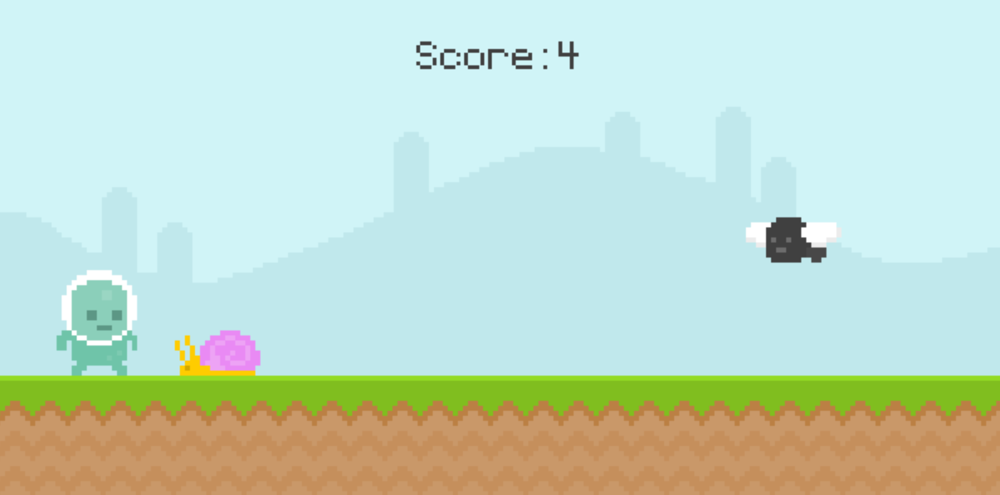
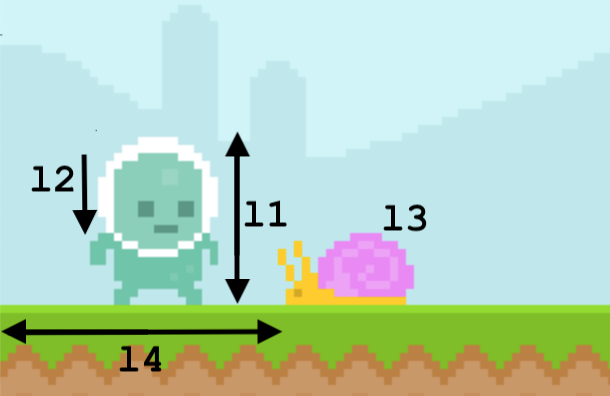

# Simple PyGame game with Reinforcement Learning

Simple runner game with where a player can jump over two types of obstacles: flies and snails.
If player hits the obstacle the game ends. The goal of the game is to run as long as possible.
The game allows you either to play it yourself or turn AI so that the game plays itself.



## How to run

Game is written in pygame framework and has two option to run: 
1. With human interaction (you must press space to jump)

```shell
cd ./src
python start_human.py 
```

2. With RL trained agent (AI jumps on its own)

```shell
cd ./src
python start_training_qtable.py
```

The training will take a few minutes.
After the training is complete, the result Q-table will be saved in the directory `.\qtables`.
If you run the game again it will work with the saved Q-table without additional training.  

Before execute any of the commands above you must install python requirements:

```shell
pip install -r requirements.txt
```
## How it was created

The purpose of the creation of the game is to practise the pygame framework and practise Reinforcement Learning a bit.

1. As the basis I took [this](https://www.youtube.com/watch?v=AY9MnQ4x3zk) example from [Clear Code](https://www.youtube.com/channel/UCznj32AM2r98hZfTxrRo9bQ) YouTube channel 
2. Made some refactoring
3. Then added custom [GYM](https://gym.openai.com/docs/) environment. You could read more about creating your own GYM environment [here](https://towardsdatascience.com/beginners-guide-to-custom-environments-in-openai-s-gym-989371673952)
4. And then implemented [Q-learning algorithm](https://www.learndatasci.com/tutorials/reinforcement-q-learning-scratch-python-openai-gym/) which allows training RL agent

## Custom GYM environment

Every GYM environment for Reinforcement Learning contains two important spaces: the observation space and the action space. 

For the Action Space I took a space with two distinct values: `{ 0 - not to jump, 1 - jump}`

For the Observation Space for simplicity I took a space with `l1*l2*l3*l4` distinct values where:
* l1 means all possible positions of the player in space. 
As the player doesn't move horizontally, this value simply means the height [0, 200].
* l2 means all possible gravity coefficients of the player [-20; 20].
* l3 means which type is the closest obstacle to the player `{0 - no obstacle, 1 - snail, 2 - fly}`.
* l4 means all possible positions of the closest obstacle, just its horizontal coordinate [-100, 200]. 
We ignore obstacles that are far from the player (with x coordinate more than 200)

